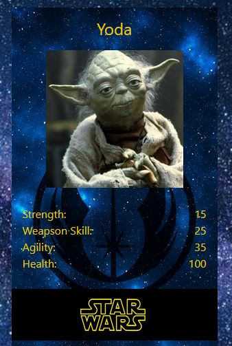

# Jedi Battle Academy

## *You don't know the power of the dark side*

Jedi Battle Academy is Card Game / Roguelike where powerful warriors (from a galaxy far, far away) battle to the death in our arena.

## How to Play

1: Select your warrior.  
2: Chat in the lobby and find an opponent.  
3: Challenge an opponent by sharing your challenge code.  
4: Select 'Start Round' when you are ready for the next round.  
5: Watch the health of your character to see how the balletic duel of lightsabres plays out.  
6: The loser is the first warrior to reach zero health.  The winner prevails.  

## Deployed Link

[Prepare for Battle!](https://jedi-battle-academy.onrender.com/)

## Credits

Lead Developer:  Sean Young  
Scrum Leader: Dyennifer Dias  
Front End Development: Deepak Jadoun  
Game Design: John Hall  
Character Sheet Design: Timothy  
Scriptwriter: Patrick Lynch  
Team Member: Jim Morel, Kasia Bogucka, Kenan Wright, Lane-Sawyer Thompson, Greg Nnabuife
